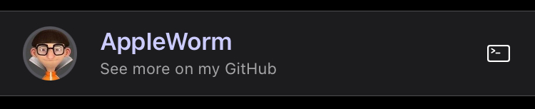
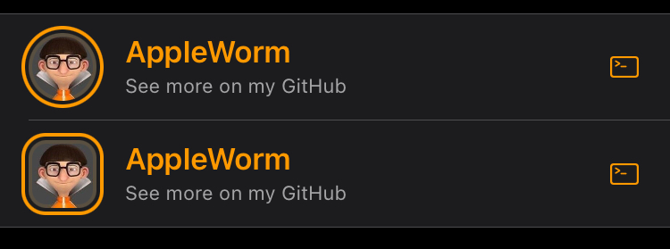

# AWSourceLinkCell
>This class I wrote because I really f\***ed up to import some kind of f\***ing libraries every time.

### Including AWSourceLinkCell
Just drag and drop **AWSourceLinkCell.h** & **AWSourceLinkCell.mm** to _YourTweakProj/Preferences_
### Known issue:
##### If your project was assembled with empty cells, then refactor <code>.mm</code> to <code>.m</code> extension
>P.S — It depends on the compiler, I do not know why this happens, but most often everything works with <code>.mm</code>, so I left the file with this extension.

### Usage

Add two magic strings:
```
<key>cellClass</key>
<string>AWSourceLinkCell</string>
```

The AWSourceLinkCell offers two options for creating a cell:
- [<code>**source**</code>](https://github.com/AppIeWorm/AWSourceLinkCell#Source-cell)
- [<code>**customSource**</code>](https://github.com/AppIeWorm/AWSourceLinkCell#Custom-source-cell)

## Source cell
The most frequently used resources referenced by jailbreak developers

##### Example:

 

```xml
<dict>
    <key>cellClass</key>
    <string>AWSourceLinkCell</string>
    <key>source</key>
    <string>GitHub</string>
    <key>username</key>
    <string>AppIeWorm</string>
    <key>footerText</key>
    <string>See more on my GitHub</string>
    <key>tintColor</key>
    <string>#CCCCFF</string>
    <key>height</key>
    <real>60</real>
</dict>
 ```
 ##### Attributes:
 
|  Attribute                  | Necessity             | Value                                      |   Default        |
|:---------------------------:|:---------------------:|:------------------------------------------:|:-----------------|
| <kbd>source</kbd>           | **Required**          | Twitter, Telegram, Instagram, GitHub, Reddit or VK |-|
| <kbd>username</kbd>         | **Required**          | Username of your account                   |-|
| <kbd>height</kbd>           | **Required**          | \<real>60\</real>                 | - |
| <kbd>image</kbd>            | **Optional**, required for VK          | A link to the image | The image will be taken from your account profile|
| <kbd>square</kbd> | **Optional** | <code>\<true/></code> or <code>\<false/></code> | Circle avatar |
| <kbd>contour</kbd> | **Optional** | <code>\<true/></code> or <code>\<false/></code> | No contour |
| <kbd>rightImage</kbd> | **Optional** | [UIImage systemImageNamed:] | No image |
| <kbd>headerText</kbd> | **Optional** | Any string | Username |
| <kbd>footerText</kbd> | **Optional** | Any string | Source |
| <kbd>tintColor</kbd> | **Optional** | <code>#RRGGBB</code> | [UIColor labelColor] |
| <kbd>footerTextColor</kbd> | **Optional** | <code>#RRGGBB</code> | [UIColor labelColor] |
| <kbd>rightImageColor</kbd> | **Optional** | <code>#RRGGBB</code> | [UIColor labelColor] |
| <kbd>contourColor</kbd> | **Optional** | <code>#RRGGBB</code> | [UIColor labelColor] |
| <kbd>tintedFooterText</kbd> | **Optional** | <code>\<true/></code> or <code>\<false/></code> | false |
| <kbd>tintedRightImage</kbd> | **Optional** | <code>\<true/></code> or <code>\<false/></code> | false |
| <kbd>tintedContour</kbd> | **Optional** | <code>\<true/></code> or <code>\<false/></code> | false |

 
##### Circled and Squared avatars with tinted contours and right images:
 
 
  ```xml
  <dict>
      <key>cellClass</key>
      <string>AWSourceLinkCell</string>
      <key>source</key>
      <string>GitHub</string>
      <key>username</key>
      <string>AppIeWorm</string>
      <key>footerText</key>
      <string>See more on my GitHub</string>
      <key>tintColor</key>
      <string>#ff9900</string>
      <key>contour</key>
      <true/>
      <key>tintedContour</key>
      <true/>
      <key>tintedRightImage</key>
      <true/>
      <key>height</key>
      <real>60</real>
  </dict>
  <dict>
     <key>cellClass</key>
     <string>AWSourceLinkCell</string>
     <key>source</key>
     <string>GitHub</string>
     <key>username</key>
     <string>AppIeWorm</string>
     <key>footerText</key>
     <string>See more on my GitHub</string>
     <key>tintColor</key>
     <string>#ff9900</string>
     <key>square</key>
     <true/>
     <key>contour</key>
     <true/>
     <key>tintedContour</key>
     <true/>
     <key>tintedRightImage</key>
     <true/>
     <key>height</key>
     <real>60</real>
 </dict>
  ```

## Custom source cell
Here you can specify any link you want, even to a screamer if you like

##### Example:

 

```xml
<dict>
    <key>cellClass</key>
    <string>AWSourceLinkCell</string>
    <key>customSource</key>
    <string>Any source</string>
    <key>headerText</key>
    <string>Me on my Source</string>
    <key>link</key>
    <string>https://mySource.com</string>
    <key>image</key>
    <string>https://www.pinclipart.com/picdir/big/421-4213680_cloud-logo-cloud-icon-clipart.png</string>
    <key>height</key>
    <real>60</real>
</dict>
 ```
 ##### Attributes:
 
|  Attribute                  | Necessity             | Value                                      |   Default        |
|:---------------------------:|:---------------------:|:------------------------------------------:|:-----------------|
| <kbd>customSource</kbd>     | **Required**          | Name of source                         |-|
| <kbd>headerText</kbd>         | **Required**          | Any string                   |-|
| <kbd>link</kbd>     | **Required**          | Any link you want                          |-|
| <kbd>image</kbd>            | **Required**         | A link to the image | - |
| <kbd>height</kbd>           | **Required**          | \<real>60\</real>                 | - |
| <kbd>square</kbd> | **Optional** | <code>\<true/></code> or <code>\<false/></code> | Circle avatar |
| <kbd>contour</kbd> | **Optional** | <code>\<true/></code> or <code>\<false/></code> | No contour |
| <kbd>rightImage</kbd> | **Optional** | [UIImage systemImageNamed:] | No image |
| <kbd>footerText</kbd> | **Optional** | Any string | Source |
| <kbd>tintColor</kbd> | **Optional** | <code>#RRGGBB</code> | [UIColor labelColor] |
| <kbd>footerTextColor</kbd> | **Optional** | <code>#RRGGBB</code> | [UIColor labelColor] |
| <kbd>rightImageColor</kbd> | **Optional** | <code>#RRGGBB</code> | [UIColor labelColor] |
| <kbd>contourColor</kbd> | **Optional** | <code>#RRGGBB</code> | [UIColor labelColor] |
| <kbd>tintedFooterText</kbd> | **Optional** | <code>\<true/></code> or <code>\<false/></code> | false |
| <kbd>tintedRightImage</kbd> | **Optional** | <code>\<true/></code> or <code>\<false/></code> | false |
| <kbd>tintedContour</kbd> | **Optional** | <code>\<true/></code> or <code>\<false/></code> | false |


# Conclusion
I hope my work will save someone time. **If you will use this class in your project, please leave a link to my github in credits**.
